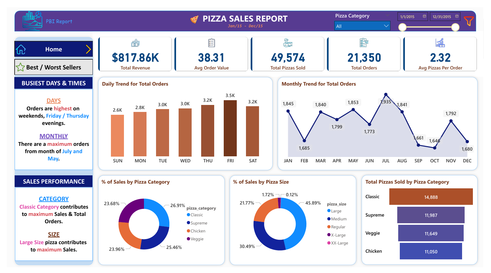
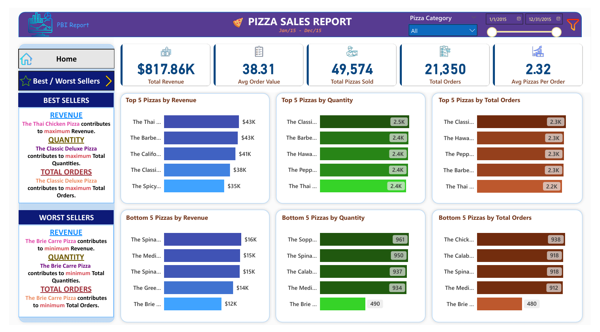

# 🍕 Pizza Sales Performance Analysis | SQL & Power BI Dashboard 

Welcome to the **Pizza Sales Performance Analysis** repository! 🚀
This project demonstrates an end-to-end analytical solution, transforming raw sales data into actionable business insights. From writing **SQL queries** to extract KPIs to designing a professional **Power BI Dashboard**, this project highlights industry-standard practices in **Data Analysis and Data Visualization**.

---

## 📊 Data Visualization & Insights

The dashboard provides a comprehensive analysis of **sales performance**, **customer behavior**, and **product trends** through two main interactive pages:





### 1. Sales Overview & KPIs
Monitors high-level performance metrics and temporal sales patterns.
- **Key Metrics**: Tracking **$817.86K** in Total Revenue and **21,350** Total Orders.
- **Time Trends**: Peak orders occur in **July and May**, with highest activity on **weekends and Thursday/Friday evenings**.
- **Top Category**: The **Classic Category** is the primary contributor to total sales and orders.

### 2. Best & Worst Sellers
Identifies product-level performance to optimize inventory and menu decisions.
- **Top Performer**: The **Thai Chicken Pizza** leads in revenue contribution.
- **Volume Leader**: The **Classic Deluxe Pizza** dominates in both quantity sold and total orders.
- **Low Performer**: The **Brie Carre Pizza** shows the lowest performance across all key metrics.

---

## 📖 Project Overview

This project implements a professional **Data Analytics Workflow** that bridges the gap between raw relational databases and strategic business intelligence. By leveraging **SQL Querying** for data validation and KPI calculation, the analysis ensures a "Single Source of Truth" before transitioning into **Power BI** for high-level visual storytelling. This end-to-end approach transforms transactional records into a dynamic decision-making tool, specifically designed to identify operational bottlenecks, optimize menu performance, and drive revenue growth through evidence-based insights.

--- 

## ⚙️ Tools & Technologies Used

- **SQL Server**: Used as the primary relational database for robust data storage and management.
- **SQL (T-SQL)**: Utilized to perform data validation and calculate core business KPIs for accuracy.
- **SQL Server Management Studio (SSMS)**: GUI for managing and interacting with the database.
- **Power BI**: Employed to build an interactive dashboard for visual storytelling and trend analysis.
- **Power Query**: Used for efficient data transformation and cleaning within the BI environment.
- **DAX**: Applied to create custom measures for advanced analytical calculations and time-series tracking.

---

## 🚀 Project Requirements

The business required a comprehensive analysis of pizza sales data to gain actionable insights. The requirements were divided into two main categories:

### 1. KPI Metrics
The goal was to calculate the following essential business indicators:
- **Total Revenue**: Sum of the total price of all orders.
- **Average Order Value**: Average amount spent per order.
- **Total Pizzas Sold**: Sum of all pizza quantities sold.
- **Total Orders**: Total count of orders placed.
- **Average Pizzas Per Order**: Average number of pizzas sold in each order.

### 2. Chart & Visualization Requirements
Specific visualizations were required to identify trends and patterns:
- **Daily & Monthly Trends**: Identifying peak hours and periods of high order activity.
- **Sales Distribution**: Percentage of sales segmented by pizza category and size.
- **Inventory Performance**: Comparison of total pizzas sold by category.
- **Best & Worst Sellers**: Top 5 and Bottom 5 pizzas based on revenue, quantity, and total orders.

---

## 🔑 Key Features

- 🔍 **SQL-Driven Validation**: Implementation of T-SQL queries to ensure 100% data integrity and accuracy of core KPIs.
- 📊 **Dual-Layered Analytics**: A strategic two-page interactive dashboard focusing on high-level executive summaries and granular product performance.
- 📅 **Temporal Trend Analysis**: Automated identification of peak sales periods, uncovering critical daily and monthly ordering patterns.
- 🍕 **Inventory Optimization**: Dynamic ranking systems to isolate the "Top 5" and "Bottom 5" products based on revenue, quantity, and total orders.
- 💡 **Actionable Business Insights**: Integrated logic to translate complex pizza sales data into clear strategic recommendations for menu and operations.
- 🔄 **Integrated Analytical Workflow**: A professional transition from relational database querying to interactive visual storytelling.

---

## 📂 Repository Structure

```
pizza-sales-powerbi-dashboard/    # Repository Root
│
├── dataset/                      # Raw data used for analysis
│   └── pizza_sales.csv           
│
├── docs/                         # Project requirements details & dashboard previews
│   ├── charts_requirements1.png  
│   ├── charts_requirements2.png  
│   ├── dashboard_best&worst_sellers.png
│   ├── dashboard_home.png
│   └── kpis_requirements.png     
│
├── sql-scripts/                  # T-SQL scripts for KPI calculations and data validation
│   └── Pizza_Sales_Queries.sql   
│
├── Pizza_Sales_Report.pbix       # Interactive Power BI Dashboard file
├── Pizza_Sales_Report.pdf        # Static export of the analytical report
├── .gitignore                    # Files and directories to be ignored by Git
├── LICENSE                       # License information for the repository
└── README.md                     # Project documentation and insights
```

---

## 🛡️ License

This project is licensed under the [MIT License](LICENSE). You are free to use, modify, and share this project with proper attribution.

---

## 🌟 About Me

Hi! I'm **Abdullah Emad**, a **Data Engineer** driven by a core mission: **Transforming raw data into reliable, actionable assets**.

I focus on architecting robust infrastructure that makes data clean, organized, and ready for action. I believe that well-architected data is the backbone of every great decision, and I’m dedicated to implementing best practices to ensure data quality and scalability.

Let’s connect to discuss data, insights, or professional opportunities:

[](https://www.linkedin.com/in/abdullah-emad-abdullah/)
